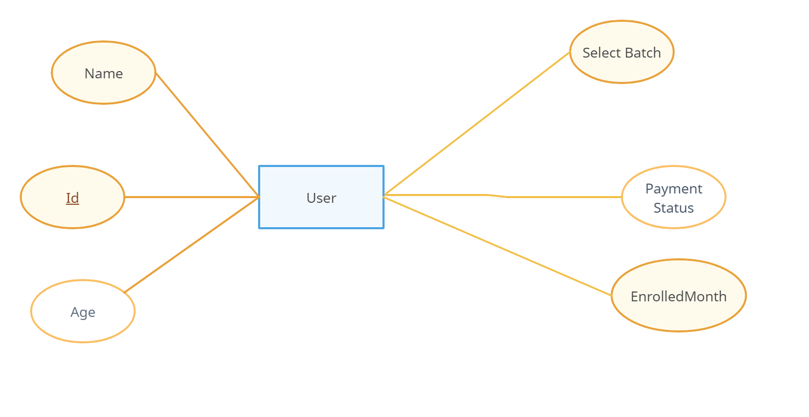

# Admission Form for Yoga Classes

## ER Diagram

## `Important Links`

- [Hosted-Frontend](https://yoga-admission-princhi.netlify.app/)
- [Hosted-Backend](https://yoga-app-backend.onrender.com)

## `Tech Stack`

- React Js
- Node Js
- Express Js
- MongoDB

## `Hosting Plateforms Used`

- `Netlify` for frontend
- `Render` for backend

## `Schema Used`

User : 
- `_id`: type : String,
- `name`: type : String,
- `age`: type : Number,
- `selectedBatch`: type : String,
- `paymentStatus`: type : Boolean,
- `enrolledMonth`: type : Number,

