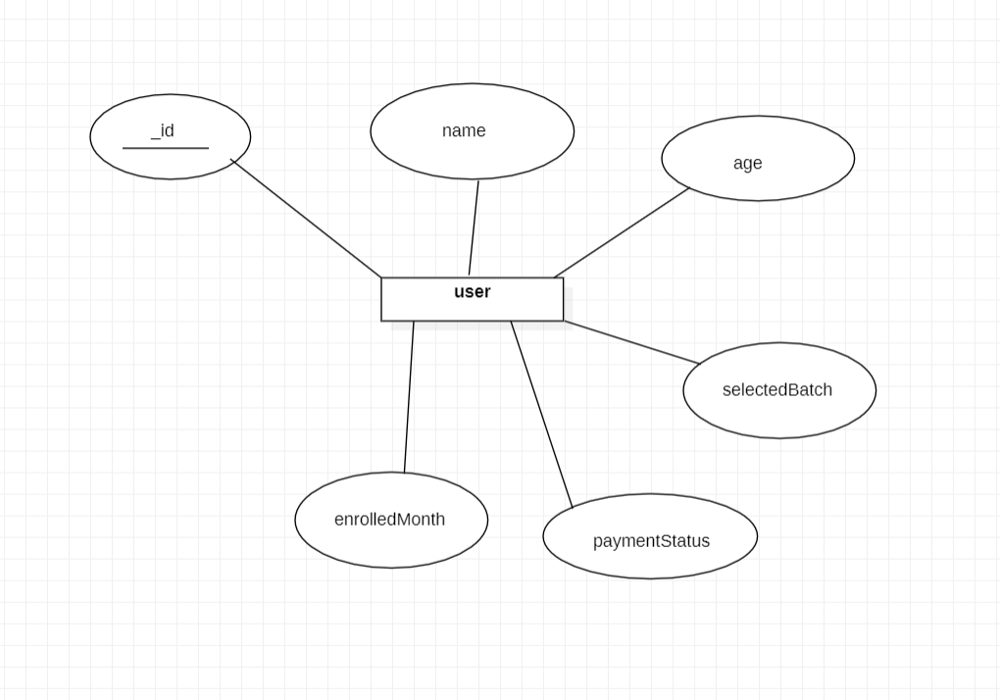

# Yoga Classes Admission Form

## Tech Stack

- React Js
- Node Js
- Express Js
- MongoDB

## Hosted Links

- [Frontend-Yoga-App](https://yoga-admission-form.netlify.app/)
- [Backend-Yoga-App](https://yoga-backend-0wzl.onrender.com/)

## Schema

User : 
- _id: String,
- name: String,
- age: Number,
- selectedBatch: String,
- paymentStatus: Boolean,
- enrolledMonth: Number,

## ER Diagram

